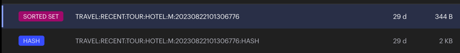
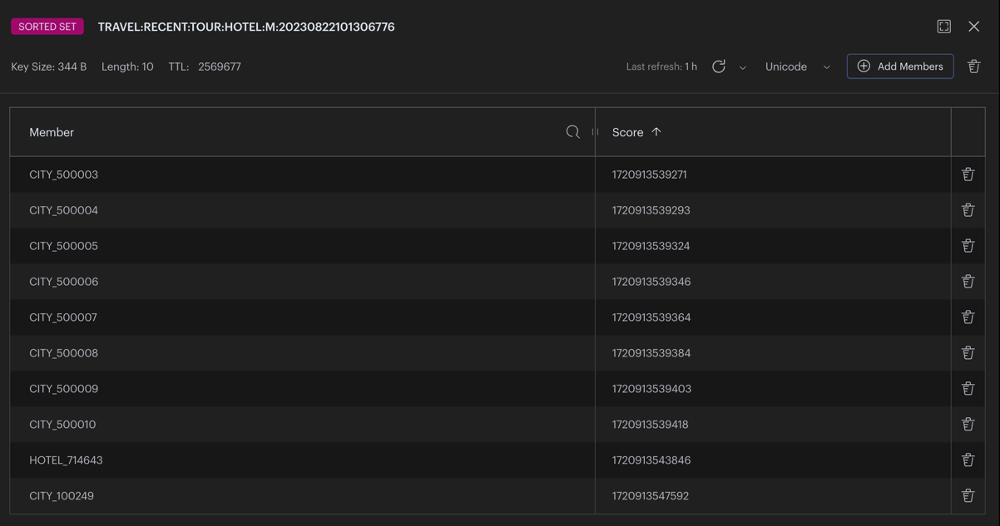
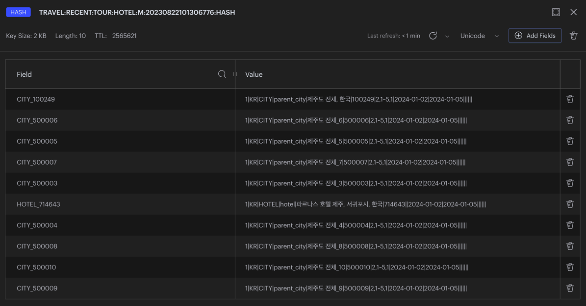
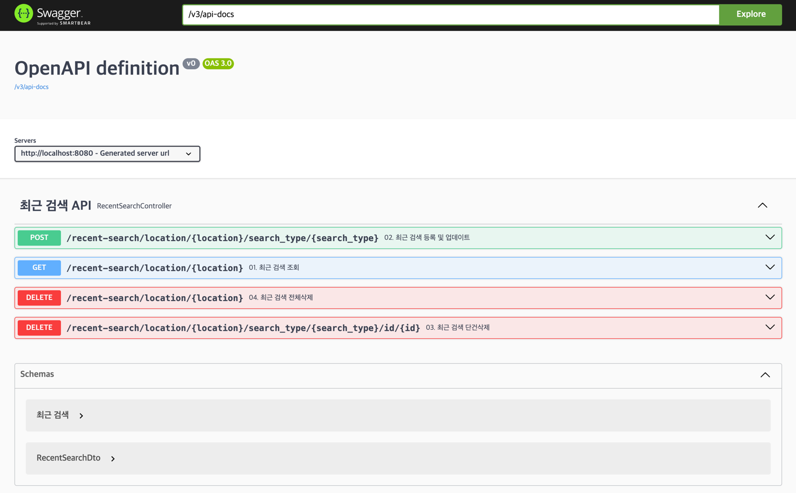
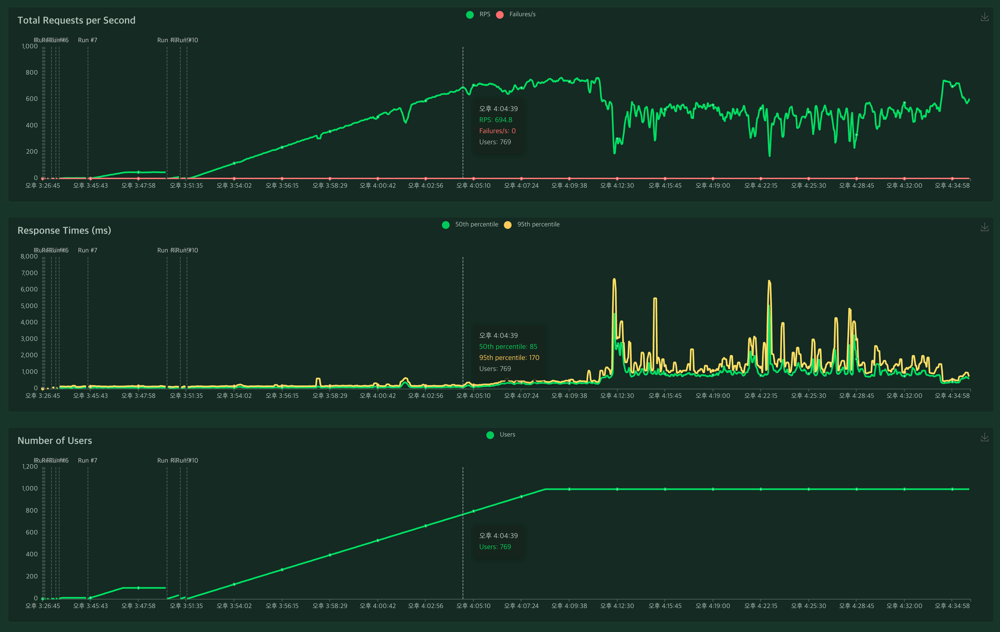
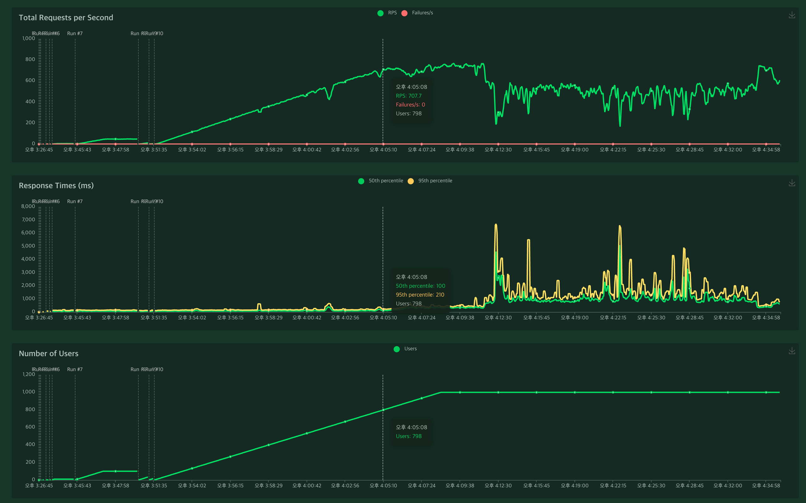
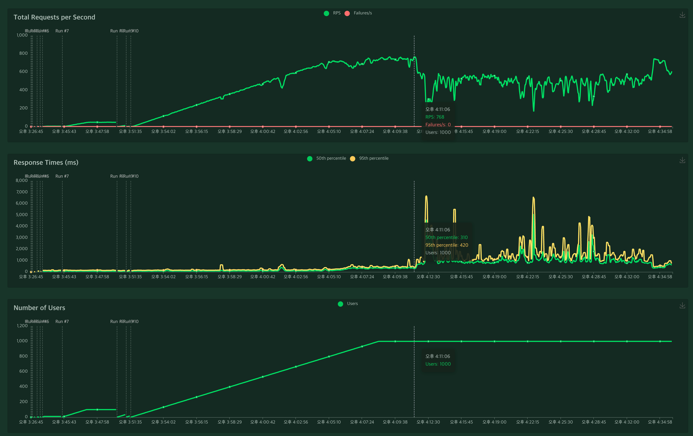
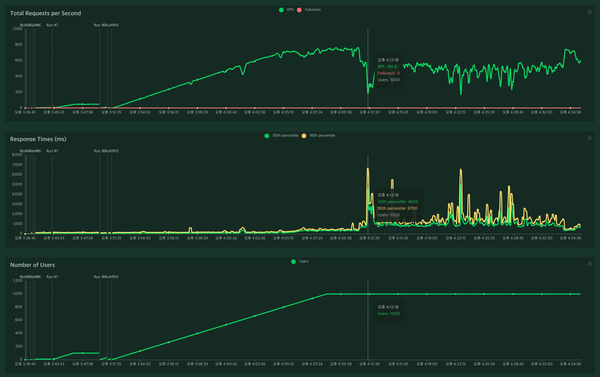
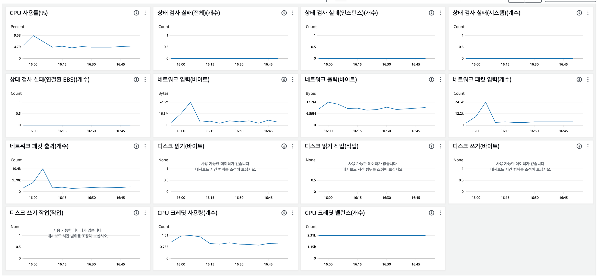

# SpringBoot Redis Sample

---

<!-- TOC -->
* [SpringBoot Redis Sample](#springboot-redis-sample)
  * [🚦 Overview](#-overview)
    * [📌 필수 조건](#-필수-조건)
  * [🚦 데이터 설계](#-데이터-설계)
    * [📌 최근검색 개발 전 데이터 형태](#-최근검색-개발-전-데이터-형태)
    * [📌 최근검색 데이터 설계](#-최근검색-데이터-설계)
    * [📌 최근 검색 KEY 설계](#-최근-검색-key-설계)
    * [📌 최근 검색 VALUE 설계](#-최근-검색-value-설계)
    * [📌 Redis 캐시 데이터 관리 정책](#-redis-캐시-데이터-관리-정책)
  * [🚦 Spring Boot Data Redis 개발환경 셋팅](#-spring-boot-data-redis-개발환경-셋팅)
    * [📌 Local Redis 구축](#-local-redis-구축)
    * [📌 build 환경 구성](#-build-환경-구성)
      * [🛠️ Gradle](#-gradle)
      * [🛠️ Maven](#-maven)
    * [📌 `application.yml` 설정](#-applicationyml-설정)
    * [📌 최근 검색 설정](#-최근-검색-설정)
  * [🚦 최근 검색 Key, HashKey, Value Serializer 구현](#-최근-검색-key-hashkey-value-serializer-구현)
    * [📌 RedisTemplate Bean 설정](#-redistemplate-bean-설정)
    * [📌 RedisSerializer 로직 구현](#-redisserializer-로직-구현)
      * [► KeySerializer 직렬화/역직렬화](#-keyserializer-직렬화역직렬화)
      * [► HashKeySerializer 직렬화/역직렬화](#-hashkeyserializer-직렬화역직렬화)
      * [► ValueSerializer 직렬화/역직렬화](#-valueserializer-직렬화역직렬화)
  * [🚦 Cache Adapter 구현](#-cache-adapter-구현)
    * [📌 정의된 RedisTemplate 의존성 주입](#-정의된-redistemplate-의존성-주입)
    * [📌 Redis 저장/수정 구현](#-redis-저장수정-구현)
    * [📌 Redis 조회 구현](#-redis-조회-구현-)
    * [📌 Redis 삭제 구현](#-redis-삭제-구현)
  * [🚦 최근 검색 서비스 구현](#-최근-검색-서비스-구현)
    * [📌 최근 검색 조회 서비스](#-최근-검색-조회-서비스)
  * [🚦 최근 검색 REST API 구현](#-최근-검색-rest-api-구현)
  * [🚦 최근 검색 테스트 코드 구현](#-최근-검색-테스트-코드-구현)
  * [🚦 Redis Data Size 계산](#-redis-data-size-계산)
    * [📌 최근검색 데이터 사이즈 계산](#-최근검색-데이터-사이즈-계산)
      * [► Key와 Value를 합산한 총 데이터 사이즈 및 예상 메모리 사이즈](#-key와-value를-합산한-총-데이터-사이즈-및-예상-메모리-사이즈)
  * [🚦 부하 테스트](#-부하-테스트)
<!-- TOC -->


## 🚦 Overview

---

회사에서 각 카테고리/검색타입 별 최근 검색 데이터를 저장/수정/조회/삭제할 필요성이 있어 최근 검색 기능을 개발

**최근 검색 카테고리**

- AIR: 항공 카테고리
- HOTEL: 숙소 카테고리
- TOACT: 투어&액티비티 카테고리
- PLACE: 여행지 찾기(플레이스) 카테고리
- PACKAGE: 패키지 카테고리)

**최근 검색 검색타입**

- AIR: 항공
- CITY: 도시
- HOTEL: 숙소
- KEYWORD: 키워드
- CATEGORY: 카테고리
- PRODUCT: 상품
- PLACE: 플레이스
- AREA: 지역

### 📌 필수 조건
- 빠른 처리 속도가 필요하므로 Redis 를 이용하여 구현해야됨
- 여러 사이트에서 각각 사용할 수 있어야됨
- 회원별/브라우저별(비회원)로 구분하여 저장해야됨
- 카테고리/검색타입별/회원별로 구분해서 저장해야됨
- 카테고리-검색타입-회원별로 유니크한 ID로 관리되며 중복데이터가 없어야됨
- 똑같은 유니크 ID의 데이터는 최근 데이터로 덮어씀
- 각 카테고리별 최근 10개의 데이터만 유지되어야 하고 조회하면 가장 최근 데이터 기준으로 정렬되어서 조회되야됨
- JSON 형태로 저장되면 저장공간을 많이 차지하므로 데이터 크기를 최소화해서 저장해야됨
- 최근검색 보관기간은 회원은 1년, 비회원은 30분간 유지하고 Expire 처리해야함
- 비회원으로 검색하다가 로그인 시 비회원으로 검색한 최근검색 데이터가 회원 최근검색 데이터에 병합되야됨
- 병합되는 데이터가 중복될 경우 경우 날짜를 기준으로 이전 데이터는 삭제처리
- 최근검색 카테고리/ID/회원타입/회원별 개별/전체 삭제가 가능해야됨


---


## 🚦 데이터 설계

---

### 📌 최근검색 개발 전 데이터 형태

```json
[{
    nationcode: string; // KR
    type: string; // city: 2, hotel: 3
    division: string; // parent_city, city, hotel
    keyword: string; // 제주도 전체, 한국
    keyword_id: string; // 714643
    keyword_urid: string | undefined;
    guestInfos: string; // 2~2,3~10,4~11
    from: { year: number, month: number, day: number };
    to: { year: number, month: number, day: number };
}]
```

### 📌 최근검색 데이터 설계

필요시 필수 파라메터 외 다른 파라메터를 추가해서 사용

- `recent_search`
    - `nation_code`: 국가코드
    - `division`: 검색 구분
    - `keyword`: 키워드명
    - `id`: 검색 ID
    - `options`: 옵션
    - `from`: 숙박 시작일 (YYYY-MM-DD)
    - `to`: 숙박 종료일 (YYYY-MM-DD)
    - `code`: 코드명
    - `data`: 데이터 (JSON 및 Array 데이터)
    - `name`: 명칭
    - `parent`: 부모 ID 또는 데이터
    - `type`: 키워드 타입(키워드 구분을 위해 필요시 사용하는 기타 타입, 검색 타입과는 다름)
    - `etc`: 기타 데이터

### 📌 최근 검색 KEY 설계

- KEY 조건
  - 서비스, 기능, 사이트, 카테고리, 회원구분, ID로 구성
- KEY 데이터 사이즈
  - `TRAVEL:RECENT:TOUR:HOTEL:M:20230822101306776`: 44 Byte



- KEY 세부정보
  1. 서비스 명: `TRAVEL`
  2. 기능 명: `RECENT`(최근검색)
  3. 사이트 명: `TOUR`
  4. 카테고리(검색위치)명: `COMM`(공통), `HOTEL`(호텔), `TOACT`(투티), `PLACE`(플레이스), `AIR`(항공), `PACKAGE`(패키지)
  5. 회원타입: `M`(회원), `V`(비회원)
  6. ID: `20230822101306776`

### 📌 최근 검색 VALUE 설계

- VALUE 조건
  - 검색 타입, 검색 ID 로 HashKey 를 생성해 회원별 데이터를 유니크하게 관리
  - HashKey가 동일할 경우 최근에 검색된 데이터가 이전 데이터를 덮어써서 최신 상태로 갱신됨
  - HashKey가 동일하지 않지만 Keyword 가 같을 경우 중복 데이터로 판단하고 필터링함
  - 각 카테고리별/회원별 최근 10개의 데이터만 유지되어야 하고 조회하면 가장 최근 데이터 기준으로 정렬되어서 조회되야됨
  - 최근검색 보관기간은 회원은 1년, 비회원은 30분간 유지하고 Expire 처리해야함
  - JSON 형태로 저장되면 저장공간을 많이 차지하므로 String 형태로 변환하여 데이터 크기를 최소화해서 저장해야됨
  - 비회원으로 검색하다가 로그인 시 비회원으로 검색한 최근검색 데이터가 회원 최근검색 데이터에 병합되야됨
  - 병합되는 데이터가 중복될 경우 경우 날짜를 기준으로 이전 데이터는 삭제처리
  - 최근검색 카테고리/ID/회원타입/회원별 개별/전체 삭제가 가능해야됨
  - 버전 구분을 두어 버전별로 다른형태의 데이터를 저장 및 조회해올 수 있도록 구성
- VALUE 데이터 사이즈
  - `1|KR|CITY|parent_city|제주도 전체, 한국|100249|2,1~5,1|2024-01-02|2024-01-05||||||`: 82 Byte
- VALUE 세부정보
  - `version`: Cache 데이터 구조 변경을 대비한 버전 관리용 버전
  - `nation_code`: 국가 코드 ex) `kr` 
  - `search_type`: 검색 타입(`AIR`:항공, `CITY`:도시, `HOTEL`:숙소, `KEYWORD`:키워드, `CATEGORY`:카테고리, `PRODUCT`:상품, `PLACE`:플레이스, `AREA`:지역)
  - `division`: 검색 구분 ex) `parent_city`, `city`, `hotel`
  - `keyword`: 키워드 명 ex) `제주도 전체`, `한국`
  - `id`: 검색 ID ex) `714643`
  - `options`: 객실 인원 ex) `2~2,3~10,4~11`
  - `from`: 숙박 시작일(Pattern: YYYY-MM-DD)
  - `to`: 숙박 종료일(Pattern: YYYY-MM-DD)
  - `code`: 코드
  - `data`: 데이터(JSON 및 Array 데이터)
  - `name`: 명칭
  - `parent`: 부모 ID 또는 데이터 
  - `type`: 타입(기타 옵션 타입)
  - `etc`: 기타 데이터

### 📌 Redis 캐시 데이터 관리 정책

최근 검색 캐시 데이터는 정렬을 위한 `Sorted Set` 과 상세 데이터 저장을 위한 `Hash` 두가지 캐쉬데이터를 한셋트로 관리함

- 정렬을 위한 `Sorted Set`
  - 최근 검색 조회와 정렬을 위해 `Sorted Set`을 사용하여 유니크한  `type` + `_` + `id` Field 값과 `Score`(**Timestamp**) Value 값 구조로 저장
  - 해당 아이디타입 별로 `Sorted Set`을 생성해 검색 타입과 검색 ID를 조합하여 데이터 리스트를 생성해 최대 10개까지 관리
  - Cache 데이터 등록시 **Timestamp** 값을 `Score`로 등록하여 `Score`로 순서를 정렬할 수있음



- 상세 데이터 저장을 위한 `Hash`
  - `Sorted Set`과 동일한 `type` + `_` + `id` Field 값에 Json 데이터를 String 데이터로 변환한 상세 데이터를 저장 
  - 먼저 `Sorted Set`에서 해당 KEY의 최근 검색를 가져와 정렬 한다음 각 `Hash` 에서 상세 데이터를 조회 
  - `Score`(**Timestamp**) 값으로 최근 검색 데이터순으로 정렬 한다음 비회원 최근 검색 10개와 회원 최근 검색 10개를 Merge 하고 중복 데이터를 제거한 다음 가장 최근 데이터 10개만 추출 
  - 각 회원구분별로 Hash 타입으로 Value를 관리함으로 인해 삭제가 용이하고 Hash 자료구조는 Redis에서 메모리를 가장 적게 차지하는 자료구조로 저장 공간을 효율적으로 사용할 수있다는 장점이 있음 
  - 각 회원구분별로 Expire 설정이 가능한 관계로 10개의 데이터의 Expire가 동일하게 유지되거나 업데이트됨




---


## 🚦 Spring Boot Data Redis 개발환경 셋팅

---

### 📌 Local Redis 구축

Local Redis 는 Docker Compose 를 통해 간편하게 구축한다

프로젝트의 `script` 폴더에 `docker-compose.yml` 파일을 사용하여 구축을 진행하면 된다

먼저 Docker 를 설치하고 `script` 경로에서 `docker compose up -d` 명령을 입력하면 Local Redis 구축이 완료 된다

- Mac 에서는 Rancher Desktop 을 설치해서 Docker 환경을 구성한다
  - https://docs.rancherdesktop.io/getting-started/installation/
  - https://www.sktenterprise.com/bizInsight/blogDetail/dev/2465
- 참고
  - https://docs.docker.com/compose/
  - https://docs.docker.com/compose/reference/

```yaml
# 실행하려는 컨테이너들 정의
services:  
  # 서비스명
  redis:
    # 사용할 이미지
    image: redis:latest
    # 컨테이너명
    #container_name: redis
    # 접근 포트 설정(컨테이너 외부:컨테이너 내부)
    ports:
      - 6379:6379
    # 스토리지 마운트(볼륨) 설정
    volumes:
      - data:/data
    # 컨테이너에 docker label을 이용해서 메타데이터 추가
    labels:
      - "name=redis"
      - "mode=standalone"
    environment:
      TZ: "Asia/Seoul"
    # 컨테이너 종료시 재시작 여부 설정
    # no : 재시작 하지 않음.
    # always : exit code와 상관없이 항상 재시작.
    # on-failure : exit code가 0일 아닐때만 재시작
    # unless-stopped : 컨테이너 상태를 수동으로 stop 하기전까지 재시작.
    restart: on-failure
    command: redis-server --port 6379 --bind 0.0.0.0 --save 20 1
volumes:
  data:
```


### 📌 build 환경 구성

- build 설정 참고
  - https://www.baeldung.com/spring-boot-redis-cache
  - https://spring.io/guides/gs/messaging-redis
  - https://docs.spring.io/spring-data/redis/reference/index.html

#### 🛠️ Gradle

```groovy
dependencies {
  implementation 'org.springframework.boot:spring-boot-starter-cache'
  implementation 'org.springframework.boot:spring-boot-starter-data-redis'
  implementation 'org.apache.commons:commons-pool2:2.12.0'
}
```

#### 🛠️ Maven

```xml
<dependencies>
    <dependency>
        <groupId>org.springframework.boot</groupId>
        <artifactId>spring-boot-starter-cache</artifactId>
    </dependency>
    <dependency>
        <groupId>org.springframework.boot</groupId>
        <artifactId>spring-boot-starter-data-redis</artifactId>
    </dependency>
    <dependency>
    <groupId>org.apache.commons</groupId>
    <artifactId>commons-pool2:2.12.0</artifactId>
    </dependency>
</dependencies>
```

### 📌 `application.yml` 설정


- 참고
  - https://docs.spring.io/spring-data/redis/reference/redis/drivers.html#redis:connectors:connection
  - https://blakes-organization.gitbook.io/springboot2/cache/redis-cache

```yaml
spring:
  data:
    redis:
      host: 127.0.0.1
      port: 6379
      client-type: lettuce
      timeout: 1s
      connect-timeout: 5s
      lettuce:
        pool:
          enabled: true
          max-active: 4 # pool에 할당될 수 있는 커넥션 최대수(음수로 사용시 무제한)
          max-idle: 4 # pool의 idle 커넥션 최대수(음수로 사용시 무제한)
          max-wait: 5s # pool이 바닥났을 때 예외발생 전에 커넥션 할당 차단의 최대 시간(단위: 밀리세컨드, 음수는 무제한 차단)
          min-idle: 1 # pool에서 관리하는 idle 커넥션 최소 수(양수일 때만 유효)
          time-between-eviction-runs: 10m # 10분마다 사용하지 않는 POOL 정리
```


### 📌 최근 검색 설정

```java
@Slf4j
@Data
@Configuration
@ConfigurationProperties(prefix = "recent")
public class RecentConfig {

    private Search search;
    private View view;

    @Data
    public static class Search {
        // member_no 만료 시간
        private Duration memberExpire = Duration.ofDays(365);
        // idvisitor 만료 시간
        private Duration idvisitorExpire = Duration.ofMinutes(30);
        // Cache 쓰기 가능 여부 (true: 쓰기 가능, false: 쓰기 불가능)
        private boolean write = true;
        // Cache 삭제 가능 여부 (true: 삭제 가능, false: 삭제 불가능)
        private boolean delete = true;
        // Cache 최대 사이즈
        private Integer maxSize=10;
        // 테스트 사이트
        private Site testSite;
    }

    @PostConstruct
    private void init() {
        log.debug("redis-properties: {}", this);
    }
}
```

```yaml
recent:
  search:
    member-expire: 365d # 회원 캐시 유지 기간
    idvisitor-expire: 30m # 비회원 캐시 유지 기간
    write: true # 쓰기 가능 여부 (default: true)
    delete: false # 삭제 가능 여부 (default: true)
    max-size: 10 # 최대 캐시 사이즈 (default: 10)
    test-site: tourvis # 테스트 사이트 사용 여부 (테스트 코드에서만 사용)
```


---


## 🚦 최근 검색 Key, HashKey, Value Serializer 구현

---

RedisAutoConfiguration 에서 제공하는 RedisTemplate 스프링 빈은 범용으로 쓸 수 있도록 RedisKey 와 RedisValue 타입으로 Object를 사용한다

예제에서는 별도의 RedisTemplate 스프링 빈을 설정하여 특정 클래스를 RedisKey 와 RedisValue 의 클래스 타입으로 사용한다

- RedisKey: 문자열 데이터를 구분할 수 있는 유니크 키
- RedisValue: 문자열 자료 구조에 저장될 데이터

- 참고
  - https://assu10.github.io/dev/2023/09/30/springboot-redis-2/
  - https://growth-coder.tistory.com/228


### 📌 RedisTemplate Bean 설정

먼저 최근 검색에서 사용할 `Sorted Set`, `Hash` RedisTemplate 를 각각 설정한다

- `recentSearchZSetRedisTemplate`(`Sorted Set`): 최근 검색 데이터 정렬을 위해 사용
- `recentSearchHashRedisTemplate`(`Hash`): 상세 데이터 저장을 위해 사용

```java
@Slf4j
@EnableCaching
@Configuration
@RequiredArgsConstructor
public class RedisConfig {

    @Bean("recentSearchZSetRedisTemplate")
    public RedisTemplate<RecentSearchKey, RecentSearchHashKey> recentSearchZSetRedisTemplate(RedisConnectionFactory redisConnectionFactory) {
        RedisTemplate<RecentSearchKey, RecentSearchHashKey> redisTemplate = new RedisTemplate<>();
        redisTemplate.setConnectionFactory(redisConnectionFactory);
        redisTemplate.setKeySerializer(new RecentSearchKeySerializer());
        redisTemplate.setValueSerializer(new RecentSearchHashKeySerializer());
        return redisTemplate;
    }

    @Bean("recentSearchHashRedisTemplate")
    public RedisTemplate<RecentSearchKey, RecentSearchValue> recentSearchHashRedisTemplate(RedisConnectionFactory redisConnectionFactory) {
        RedisTemplate<RecentSearchKey, RecentSearchValue> redisTemplate = new RedisTemplate<>();
        redisTemplate.setConnectionFactory(redisConnectionFactory);
        redisTemplate.setKeySerializer(new RecentSearchKeySerializer());
        redisTemplate.setHashKeySerializer(new RecentSearchHashKeySerializer());
        redisTemplate.setHashValueSerializer(new RecentSearchValueSerializer());
        return redisTemplate;
    }
}
```

### 📌 RedisSerializer 로직 구현


**RedisSerializer** 를 상속받아 Key(RedisKey), HashKey(Field), Value(Value) 직렬화/역직렬화 해준다

직렬화/역직렬화 코드를 구현한다음 RedisSerializer Generic 클래스로 지정해주면 된다

상세 구현 로직은 `RecentSearchKey`, `RecentSearchHashKeySerializer`, `RecentSearchValueSerializer` 코드를 참고하자 


#### ► KeySerializer 직렬화/역직렬화

```java
@Slf4j
public class RecentSearchKeySerializer implements RedisSerializer<RecentSearchKey> {

    @Override
    public byte[] serialize(RecentSearchKey recentSearchKey) throws SerializationException {
        if (Objects.isNull(recentSearchKey))
            throw new SerializationException("recentSearchKey is null");
        return recentSearchKey.toString().getBytes(StandardCharsets.UTF_8);
    }

    @Override
    public RecentSearchKey deserialize(byte[] bytes) throws SerializationException {
        if (Objects.isNull(bytes))
            throw new SerializationException("bytes is null");
        RecentSearchKey key = RecentSearchKey.fromString(new String(bytes, StandardCharsets.UTF_8));
        return key;
    }
}
```

#### ► HashKeySerializer 직렬화/역직렬화

```java
@Slf4j
public class RecentSearchHashKeySerializer implements RedisSerializer<RecentSearchHashKey> {

    @Override
    public byte[] serialize(RecentSearchHashKey recentSearchHashKey) throws SerializationException {
        if (Objects.isNull(recentSearchHashKey))
            throw new SerializationException("recentSearchHashKey is null");
        return recentSearchHashKey.toString().getBytes(StandardCharsets.UTF_8);
    }

    @Override
    public RecentSearchHashKey deserialize(byte[] bytes) throws SerializationException {
        if (Objects.isNull(bytes))
            throw new SerializationException("bytes is null");
        RecentSearchHashKey hashKey = RecentSearchHashKey.fromString(new String(bytes, StandardCharsets.UTF_8));
        return hashKey;
    }
}
```

#### ► ValueSerializer 직렬화/역직렬화

Value 값은 Json 데이터를 String 데이터로 변환하여 구분자로 구분하여서 처리 하므로 직렬화/역직렬화 과정이 약간 복잡하지만 자세히 보면 코드를 이해하는 것은 어렵지 않다

```java
@Slf4j
public class RecentSearchValueSerializer implements RedisSerializer<RecentSearchValue> {
    @Override
    public byte[] serialize(RecentSearchValue recentSearchValue) throws SerializationException {
        if (Objects.isNull(recentSearchValue)) {
            return null;
        }

        StringJoiner value = new StringJoiner("|");
        value.add(recentSearchValue.getVersion());
        value.add(replaceSeparator(recentSearchValue.getNationCode()));
        value.add(recentSearchValue.getSearchType());
        value.add(replaceSeparator(recentSearchValue.getDivision()));
        value.add(recentSearchValue.getKeyword());
        value.add(recentSearchValue.getId());
        value.add(replaceSeparator(recentSearchValue.getOptions()));
        value.add(recentSearchValue.getFrom() != null ? recentSearchValue.getFrom().toString() : "");
        value.add(recentSearchValue.getTo() != null ? recentSearchValue.getTo().toString() : "");
        value.add(replaceSeparator(recentSearchValue.getCode()));
        value.add(replaceSeparator(recentSearchValue.getData()));
        value.add(StringUtils.defaultIfEmpty(recentSearchValue.getName(), ""));
        value.add(StringUtils.defaultIfEmpty(recentSearchValue.getParent(), ""));
        value.add(StringUtils.defaultIfEmpty(recentSearchValue.getType(), ""));
        value.add(StringUtils.defaultIfEmpty(recentSearchValue.getEtc(), ""));
        // log.debug("recent_search_value serialize: {}", value);
        return value.toString().getBytes(StandardCharsets.UTF_8);
    }

    @Override
    public RecentSearchValue deserialize(byte[] bytes) throws SerializationException, DateTimeParseException {
        if (Objects.isNull(bytes)) {
            return null;
        }

        String[] splitValue = new String(bytes, StandardCharsets.UTF_8).split("\\|");

        int i = 0;
        String version = setValue(splitValue, i++); // 0
        String nationCode = setValue(splitValue, i++); // 1
        String searchType = setValue(splitValue, i++); // 2
        String division = setValue(splitValue, i++); // 3
        String keyword = setValue(splitValue, i++); // 4
        String id = setValue(splitValue, i++); // 5
        String options = setValue(splitValue, i++); // 7
        LocalDate from = parseLocalDate(splitValue, i); // 8
        i++;
        LocalDate to = parseLocalDate(splitValue, i); // 9
        i++;
        String code = setValue(splitValue, i++); // 10
        String data = setValue(splitValue, i++); // 11
        String name = setValue(splitValue, i++); // 12
        String parent = setValue(splitValue, i++); // 13
        String type = setValue(splitValue, i++); // 14
        String etc = setValue(splitValue, i++); // 15
        RecentSearchValue recentSearchValue = RecentSearchValue.from(version, nationCode, searchType, division, keyword, id, options, from, to, code, data, name, parent, type, etc);
        // log.debug("recent_search_value deserialize: {}", recentSearchValue);
        return recentSearchValue;
    }
  
    ...
  
}
```


---


## 🚦 Cache Adapter 구현

---

- 참고
  - https://www.gilbut.co.kr/book/view?bookcode=BN003571#bookData

Cache Adapter 에서 정의된 RedisTemplate 를 사용해 Redis Cache 데이터를 저장/수정/삭제/조회 처리 한다


### 📌 정의된 RedisTemplate 의존성 주입

앞에서 정의한 RedisTemplate 를 사용하기 위해 의존성을 주입 받는다

```java
@Slf4j
@Component
public class RecentSearchCacheAdapter {
    private final RedisTemplate<RecentSearchKey, RecentSearchHashKey> recentSearchZSetRedisTemplate;
    private final RedisTemplate<RecentSearchKey, RecentSearchValue> recentSearchHashRedisTemplate;
    private final ZSetOperations<RecentSearchKey, RecentSearchHashKey> zSetOperation;
    private final HashOperations<RecentSearchKey, RecentSearchHashKey, RecentSearchValue> hashOperation;
    private final RedisOperations<RecentSearchKey, RecentSearchValue> redisOperations;
    private final RecentConfig recentConfig;

    public RecentSearchCacheAdapter(RedisTemplate<RecentSearchKey, RecentSearchHashKey> recentSearchZSetRedisTemplate,
                                    RedisTemplate<RecentSearchKey, RecentSearchValue> recentSearchHashRedisTemplate,
                                    RecentConfig recentConfig) {
        this.recentSearchZSetRedisTemplate = recentSearchZSetRedisTemplate;
        this.recentSearchHashRedisTemplate = recentSearchHashRedisTemplate;
        this.zSetOperation = recentSearchZSetRedisTemplate.opsForZSet();
        this.hashOperation = recentSearchHashRedisTemplate.opsForHash();
        this.redisOperations = recentSearchHashRedisTemplate;
        this.recentConfig = recentConfig;
    }
    
    ...
    
}
```


### 📌 Redis 저장/수정 구현

`put` 메서드를 통해 최근 검색 Key, HashKey, Value 값을 직렬화해서 저장/수정 한다

최근 검색 설정 값에서 MaxSize 값을 읽어와 해당 값(10)만큼만 저장되도록 한다

```java
public void put(RecentSearchKey key, RecentSearchHashKey hashKey, RecentSearchValue value, LocalDateTime localDateTime) {
    if (!recentConfig.getSearch().isWrite()) {
        log.info("Redis:: RecentSearch Write: {}", false);
        return;
    }

    Duration expire = getExpire(key);

    log.debug("Redis:: RecentSearch Put key: {}, hashKey: {}, value: {}, expire: {}", key, hashKey, value, expire);

    zSetOperation.add(key, hashKey, Timestamp.valueOf(localDateTime).getTime());
    zSetOperation.getOperations().expire(key, expire);
    hashOperation.put(key.hash(), hashKey, value);
    hashOperation.getOperations().expire(key.hash(), expire);
    if (Objects.requireNonNull(zSetOperation.size(key)) > recentConfig.getSearch().getMaxSize() ) {
        // ZSet에 저장된 가장오래된 최근검색 Cache 값
        // log.debug("delete: {}",zSetOperation.rangeWithScores(key, 0, 0));
        // ZSet에 저장된 가장오래된 최근검색 Cache Key 삭제
        TypedTuple<RecentSearchHashKey> popMin = zSetOperation.popMin(key); // [DefaultTypedTuple [score=1.702617471153E12, value=3_1552577]]
        // Hash에 저장된 가장오래된 최근검색 Cache Value 삭제
        if (popMin != null) hashOperation.delete(key.hash(), popMin.getValue()); // DefaultTypedTuple [score=1.702617471153E12, value=3_1552577]
    }
}
```


### 📌 Redis 조회 구현 

`get` 메서드를 통해 최근 검색 Key 에 해당하는 데이터를 조회하고 정렬해서 응답한다

조회를 할때 먼저 HashKey를 조회해서 `Score`를 바탕으로 정렬을 하고 정렬된 HashKey로 `Value`를 조회한다  

```java
public List<RecentSearchValue> get(List<RecentSearchKey> keys) {
    LocalDateTime now = LocalDateTime.now();
    List<RecentSearchHashKey> hashKeys = List.copyOf(keys.stream()
            .map(key -> zSetOperation.reverseRangeWithScores(key, 0, recentConfig.getSearch().getMaxSize()-1))
            .filter(Objects::nonNull)
            .flatMap(Set::stream)
            .map(RecentSearchHashKey::to)
            .collect(Collectors.toCollection(LinkedHashSet::new)));
    return List.copyOf(keys.stream()
            .map(key -> {
                Long ttl = redisOperations.getExpire(key);
                return hashKeys.stream()
                        .map(hashKey -> getRecentSearchValue(key, hashKey, ttl, now))
                        .filter(Objects::nonNull)
                        .toList();
            })
            .flatMap(List::stream)
            .sorted(Comparator.comparing(RecentSearchValue::getUpdatedAt).reversed().thenComparing(RecentSearchValue::getIdType))
            .filter(CollectionUtil.distinctByKey(RecentSearchValue::getId))
            .limit(recentConfig.getSearch().getMaxSize()) // merge 후 maxSize 만큼만 가져옴
            .collect(Collectors.toCollection(LinkedHashSet::new)));
}
```


### 📌 Redis 삭제 구현

`delete` 메서드를 통해 최근 검색 Key, HashKey 캐시 데이터를 삭제 한다

HashKey 가 없으면 Key 에 해당되는 캐시 데이터를 모두 삭제하고 HashKey 가 있으면 해당 HashKey 캐시 데이터만 삭제 한다

```java
public int delete(RecentSearchKey key, RecentSearchHashKey hashKey) {
    if (!recentConfig.getSearch().isDelete()) {
        log.info("Redis:: RecentSearch Delete: {}", false);
        return 0;
    }
    if (StringUtils.isNotBlank(hashKey.toString())) {
        log.debug("Redis:: RecentSearch Delete key: {}, hashkey: {}", key, hashKey);
        if (isEmpty(key, hashKey)) return 0;
        zSetOperation.remove(key, hashKey); // zSet 정렬데이터 삭제
        Long delete = hashOperation.delete(key.hash(), hashKey); // hash 데이터 삭제
        return delete.intValue();
    }
    log.debug("Redis:: RecentSearch Delete key: {}", key);
    if (isEmpty(key)) return 0;
    redisOperations.unlink(key);
    Long unlink = redisOperations.unlink(List.of(key.hash()));
    unlink = unlink != null ? unlink : 0;
    return unlink.intValue();
}
```


---


## 🚦 최근 검색 서비스 구현

---

최근 검색 서비스는 서비스 로직 처리와 함께 구현된 Cache Adapter 기능을 사용하여 Redis 캐시 데이터를 처리 한다

최근 검색 캐시 데이터를 저장/수정/삭제 처리하는 로직은 그리 어렵지 않으니 생략하고 조회하는 로직만 소개하겠다

저장/수정/삭제 처리 로직은 최근 검색 서비스를 참고 하면된다


### 📌 최근 검색 조회 서비스

최근 검색 조회 서비스는 비회원 최근 검색 캐시 데이터가 있을 경우 비회원 데이터를 회원 데이터에 병합해야 된다

등록은 매번 일어나지는 않지만 조회는 매번 일어나기 때문에 최근 검색 조회 서비스에서 병합 처리를 진행한다

병합 처리를 진행할 때 반드시 동기식으로 처리될 필요가 없기 때문에 성능 향상을 위해 `CompletableFuture.runAsync()` 를 사용하여 비동기로 처리한다

```java
/**
 * Cache 정리(member_no가 있을 시 idvisitor Cache 삭제)
 * idvisitor Cache를 정리했으면 병합된 데이터를 반환
 * idivisitor가 있으면 member_no와 병합된 데이터를 put 하고 idvisitor Cache 삭제
 */
private List<RecentSearchValue> getValuesWithCleansing(String site, List<RecentSearchKey> keys) {
    RecentSearchKey memberNoKey = RecentSearchKey.recentSearchKeyByIdType(keys, IdType.M);
    RecentSearchKey idvisitorKey = RecentSearchKey.recentSearchKeyByIdType(keys, IdType.V);

    String memberNo = memberNoKey != null ? memberNoKey.getIdValue() : null;
    String idvisitor = idvisitorKey != null ? idvisitorKey.getIdValue() : null;

    log.debug("getValuesWithCleansing: {}, {}, {}", site, memberNo, idvisitor);

    // Cache Cleansing 비동기 처리
    CompletableFuture.runAsync(() -> allCacheCleansing(site, memberNo, idvisitor), es);
    return cacheAdapter.get(keys);
}
```

최근 검색 데이터 비회원 캐시 데이터 병합 처리는 비회원 데이터가 회원 데이터보다 더 최근 데이터가 있는지, 회원 데이터에 없는 데이터가 있는지 확인해서 
더 최근 데이터가 있거나 회원 데이터에 없는 데이터가 있는 경우에만 회원 데이터에 덮어씌우거나 병합한다

```java
/**
 * member_no 로그인시 idvisitor 모든 Cache cleansing 처리
 * @param site 사이트
 * @param memberNo 회원ID
 * @param idvisitor 비회원ID
 */
private void allCacheCleansing(String site, String memberNo, String idvisitor) {
    if (StringUtils.isBlank(memberNo) || StringUtils.isBlank(idvisitor)) return;
    long start = System.currentTimeMillis();
    log.debug("allCacheCleansing start: {}, {}, {}", site, memberNo, idvisitor);
    AtomicInteger updateCount = new AtomicInteger();
    LocalDateTime now  = LocalDateTime.now();
    for (RecentSearch.Inventory inventory: RecentSearch.Inventory.values()) {
        RecentSearchKey idvisitorKey = RecentSearchKey.to(site, inventory.getLocation().name().toLowerCase(), IdType.V.name(), idvisitor);
        // log.debug("allCacheCleansing idvisitorKey: {}, isEmpty: {}",idvisitorKey, cacheAdapter.isEmpty(idvisitorKey));
        if (cacheAdapter.isEmpty(idvisitorKey)) continue; // merge 할 idvisitor 캐시가 없다면 PASS
        RecentSearchKey memberNoKey = RecentSearchKey.to(site, inventory.getLocation().name().toLowerCase(), IdType.M.name(), memberNo);
        // log.debug("allCacheCleansing memberNoKey: {}: isEmpty: {}",memberNoKey, cacheAdapter.isEmpty(memberNoKey));
        // if (cacheAdapter.isEmpty(memberNoKey)) continue;

        // 1. idvisitor 캐시 조회
        List<RecentSearchValue> idvisitorValues = cacheAdapter.get(idvisitorKey, now);
        // log.debug("allCacheCleansing cleansing - idvisitorKey: {}, size: {}", idvisitorKey, idvisitorValues.size());
        // 2. idvisitor 캐시 삭제
        // cacheAdapter.delete(idvisitorKey, RecentSearchHashKey.to(null, null));
        // 3. member_no에 idvisitor 캐시 병합
        idvisitorValues.forEach(idvisitorValue -> {
            // idvisitorKey와 동일한 memberNoKey 데이터 조회
            RecentSearchValue memberValue = cacheAdapter.get(memberNoKey, RecentSearchHashKey.to(idvisitorValue), now);
            // 동일한 memberNo 데이터가 있다면 idvisitor 데이터보다 이전 데이터인지 확인
            boolean before = memberValue != null && idvisitorValue.getUpdatedAt().isAfter(memberValue.getUpdatedAt());
            // idvisitor와 동일한 memberNo 데이터가 없으면 idvisitor 데이터 memberNo 최근 검색에 merge 처리
            // idvisitor 데이터보다 memberNo 데이터가 이전 데이터이면 idvisitor 최근 검색 조회 시간으로 업데이트
            if (cacheAdapter.isEmpty(memberNoKey, RecentSearchHashKey.to(idvisitorValue)) || before) {
                cacheAdapter.put(memberNoKey, RecentSearchHashKey.to(idvisitorValue), idvisitorValue, idvisitorValue.getUpdatedAt());
                updateCount.getAndIncrement();
            }
        });
    }
    long end = System.currentTimeMillis();
    log.debug("allCacheCleansing end: {}, {}, {}, updateCount: {}, execute time: {} ms", site, memberNo, idvisitor, updateCount, ( end - start )/1000.0);
}
```


---


## 🚦 최근 검색 REST API 구현

---

최근 검색 조회, 등록/수정, 단건삭제, 전체삭제 REST API 컨트롤러를 구현한다

각 REST API는 Swagger API Docs 나 테스트 코드를 통해 테스트 해본다

```java
@Slf4j
@RestController
@Tag(name = "최근 검색 API", description = "RecentSearchController")
@RequestMapping("/recent-search")
@RequiredArgsConstructor
public class RecentSearchController {

    private final CustomCollectionValidator customCollectionValidator;
    private final RecentSearchService recentSearchService;

    @Operation(summary = "01. 최근 검색 조회")
    @GetMapping("/location/{location}")
    public ResponseEntity<List<RecentSearch>> getRecentSearch(
            @Parameter(description = "검색 위치(AIR: 항공, HOTEL: 숙소 , TOACT: 투어&티켓, PLACE: 플레이스, PACKAGE: 패키지)", example = "HOTEL",
                    schema = @Schema(description = "검색 위치",type = "string", allowableValues = {"AIR", "HOTEL", "TOACT", "PLACE", "PACKAGE"}))
            @PathVariable(value = "location", required = false) String location,
            @Parameter(description = "회원번호", example = "20230822101306776")
            @RequestParam(value = "member_no", required = false) String memberNo,
            @Parameter(description = "브라우저 id", example = "eb30dfe378b38c58")
            @RequestParam(value = "idvisitor", required = false) String idvisitor
    ) {
        return ResponseEntity.ok(recentSearchService.get(Site.TOUR, location, memberNo, idvisitor));
    }

    @Operation(summary = "02. 최근 검색 등록 및 업데이트")
    @PostMapping("/location/{location}/search_type/{search_type}")
    @io.swagger.v3.oas.annotations.parameters.RequestBody(content = @Content(examples = @ExampleObject(value = POST_EXAM)))
    public ResponseEntity<HttpStatus> setRecentSearch(
            @Parameter(description = "검색 위치(AIR: 항공, HOTEL: 숙소 , TOACT: 투어&티켓, PLACE: 플레이스, PACKAGE: 패키지)", example = "HOTEL",
                    schema = @Schema(description = "검색 위치",type = "string", allowableValues = {"AIR", "HOTEL", "TOACT", "PLACE", "PACKAGE"}))
            @PathVariable(value = "location") String location,
            @Parameter(description = "검색 타입(AIR[AIR: 항공], HOTEL[CITY: 도시, HOTEL: 호텔], TOACT[KEYWORD: 키워드, CITY: 도시, CATEGORY: 카테고리, PRODUCT: 상품], PLACE[PLACE: 플레이스], PACKAGE[KEYWORD: 키워드, CITY: 도시, CATEGORY: 카테고리(모상품), PRODUCT: 상품(자상품), AREA: 지역별])", example = "HOTEL",
                    schema = @Schema(description = "검색 타입",type = "string", allowableValues = {"AIR", "CITY", "HOTEL", "KEYWORD", "CATEGORY", "PRODUCT", "PLACE", "AREA"}))
            @PathVariable(value = "search_type") String searchType,
            @RequestBody @Valid RecentSearchDto dto,
            BindingResult bindingResult
    ) throws BindException {
      dto.setLocationAndSearchType(location, searchType);

      // Collection 의 경우 @Valid 로 유효성 검증이 되지 않아 직접 validate
      customCollectionValidator.validate(dto.getRecentSearch(), bindingResult);

      // Collection 유효성 검증 실패에 대한 예외처리
      if (bindingResult.hasErrors())
        throw new BindException(bindingResult);

      recentSearchService.set(dto);
      return ResponseEntity.ok().build();
    }

  @Operation(summary = "03. 최근 검색 단건삭제", description = "- **필수 입력**: `member_no` or `idvisitor`, `search_type`, `id`")
  @DeleteMapping("/location/{location}/search_type/{search_type}/id/{id}")
  public ResponseEntity<HttpStatus> deleteRecentSearch(
          @Parameter(description = "검색 위치(AIR: 항공, HOTEL: 숙소 , TOACT: 투어&티켓, PLACE: 플레이스, PACKAGE: 패키지)", example = "HOTEL",
                  schema = @Schema(description = "검색 위치",type = "string", allowableValues = {"AIR", "HOTEL", "TOACT", "PLACE", "PACKAGE"}))
          @PathVariable(value = "location") String location,
          @Parameter(description = "검색 타입(AIR[AIR: 항공], HOTEL[CITY: 도시, HOTEL: 호텔], TOACT[KEYWORD: 키워드, CITY: 도시, CATEGORY: 카테고리, PRODUCT: 상품], PLACE[PLACE: 플레이스], PACKAGE[KEYWORD: 키워드, CITY: 도시, CATEGORY: 카테고리(모상품), PRODUCT: 상품(자상품), AREA: 지역별])", example = "HOTEL",
                  schema = @Schema(description = "검색 타입",type = "string", allowableValues = {"AIR", "CITY", "HOTEL", "KEYWORD", "CATEGORY", "PRODUCT", "PLACE", "AREA"}))
          @PathVariable(value = "search_type") String searchType,
          @Parameter(description = "삭제할 키워드 ID(city_master_id, htl_master_id)", example = "714643")
          @PathVariable(value = "id") String id,
          @Parameter(description = "회원번호", example = "20230822101306776")
          @RequestParam(value = "member_no", required = false) String memberNo,
          @Parameter(description = "브라우저 id", example = "eb30dfe378b38c58")
          @RequestParam(value = "idvisitor", required = false) String idvisitor
  ) {
    recentSearchService.delete(Site.TOUR, location, memberNo, idvisitor, SearchType.valueOf(searchType), id);
    return ResponseEntity.ok().build();
  }

  @Operation(summary = "04. 최근 검색 전체삭제", description = "- **필수 입력**: `member_no` or `idvisitor`")
  @DeleteMapping("/location/{location}")
  public ResponseEntity<HttpStatus> deleteAllRecentSearch(
          @Parameter(description = "검색 위치(AIR: 항공, HOTEL: 숙소 , TOACT: 투어&티켓, PLACE: 플레이스, PACKAGE: 패키지)", example = "HOTEL",
                  schema = @Schema(description = "검색 위치",type = "string", allowableValues = {"AIR", "HOTEL", "TOACT", "PLACE", "PACKAGE"}))
          @PathVariable(value = "location") String location,
          @Parameter(description = "회원번호", example = "20230822101306776")
          @RequestParam(value = "member_no", required = false) String memberNo,
          @Parameter(description = "브라우저 id", example = "eb30dfe378b38c58")
          @RequestParam(value = "idvisitor", required = false) String idvisitor
  ) {
    recentSearchService.delete(Site.TOUR, location, memberNo, idvisitor, null, null);
    return ResponseEntity.ok().build();
  }
}
```

- URL: https://localhost:8080/swagger-ui.html

URL 로 접속하면 아래와 같은 Swagger API Docs 화면을 볼 수 있다




---


## 🚦 최근 검색 테스트 코드 구현


최근 검색 저장/수정/삭제/조회 기능을 테스트할 수 있는 테스트 코드를 작성

```java
class RecentSearchControllerTest extends BaseTest {

    private String PrefixUrl = "/recent-search";

    private RecentSearchDto recentSearchDto;

    public RecentSearchControllerTest(MockMvc mockMvc) {
        super(mockMvc);
    }

    @BeforeEach
    void setUp() {
        recentSearchDto = RecentSearchDto.builder()
                .idvisitor("eb30dfe378b38c58")
                .memberNo("20230822101306776")
                .build();
    }

    @Test
    void setDataTest() {
        recentSearchDto.setRecentSearch(
                JsonUtils.toMapperObject(getJson(SearchFile.HOTEL.getName()), RecentSearch.class));
        System.out.println(JsonUtils.toMapperPretty(recentSearchDto));
    }

    @Test
    void setRecentSearchHotelMulti() {
        IntStream.rangeClosed(1, 10).forEach(i -> {
            Integer htlMasterId = 1_000_000 + i;
            recentSearchDto.setRecentSearch(
                    JsonUtils.toMapperObject(getJson(SearchFile.HOTEL.getName()), RecentSearch.class));
            recentSearchDto.getRecentSearch().setNationCode("KR");
            recentSearchDto.getRecentSearch().setKeyword("서귀포 블라섬펜션_" + i);
            recentSearchDto.getRecentSearch().setId(htlMasterId.toString());

            System.out.println(JsonUtils.toMapperPretty(recentSearchDto));

            try {
                mockMvc.perform(post(PrefixUrl + "/location/{location}/search_type/{search_type}", Location.HOTEL, SearchType.HOTEL.name())
                                .content(JsonUtils.toMapper(recentSearchDto))
                                .contentType(MediaType.APPLICATION_JSON_VALUE))
                        .andExpect(status().isOk())
                        .andDo(print())
                        .andReturn();
            } catch (Exception e) {
                throw new RuntimeException(e);
            }
        });
    }


    @Test
    void setRecentSearchCityMulti() {
        IntStream.rangeClosed(1, 10).forEach(i -> {
            Integer cityMasterId = 500_000 + i;
            recentSearchDto.setRecentSearch(
                    JsonUtils.toMapperObject(getJson(SearchFile.CITY.getName()), RecentSearch.class));
            recentSearchDto.getRecentSearch().setNationCode("KR");
            recentSearchDto.getRecentSearch().setKeyword("제주도 전체_" + i);
            recentSearchDto.getRecentSearch().setId(cityMasterId.toString());

            System.out.println(JsonUtils.toMapperPretty(recentSearchDto));

            try {
                mockMvc.perform(post(PrefixUrl + "/location/{location}/search_type/{search_type}", Location.HOTEL, SearchType.CITY.name())
                                .content(JsonUtils.toMapper(recentSearchDto))
                                .contentType(MediaType.APPLICATION_JSON_VALUE))
                        .andExpect(status().isOk())
                        .andDo(print())
                        .andReturn();
            } catch (Exception e) {
                throw new RuntimeException(e);
            }
        });
    }

    @Test
    void setRecentSearchHotel() throws Exception {
        recentSearchDto.setRecentSearch(
                JsonUtils.toMapperObject(getJson(SearchFile.HOTEL.getName()), RecentSearch.class));

        System.out.println(JsonUtils.toMapperPretty(recentSearchDto));

        mockMvc.perform(post(PrefixUrl + "/location/{location}/search_type/{search_type}", Location.HOTEL, SearchType.HOTEL.name())
                        .content(JsonUtils.toMapper(recentSearchDto))
                        .contentType(MediaType.APPLICATION_JSON_VALUE))
                .andExpect(status().isOk())
                .andDo(print())
                .andReturn();
    }

    @Test
    void setRecentSearchCity() throws Exception {
        recentSearchDto.setRecentSearch(
                JsonUtils.toMapperObject(getJson(SearchFile.CITY.getName()), RecentSearch.class));

        System.out.println(JsonUtils.toMapperPretty(recentSearchDto));

        mockMvc.perform(post(PrefixUrl + "/location/{location}/search_type/{search_type}", Location.HOTEL, SearchType.CITY.name())
                        .content(JsonUtils.toMapper(recentSearchDto))
                        .contentType(MediaType.APPLICATION_JSON_VALUE))
                .andExpect(status().isOk())
                .andDo(print())
                .andReturn();
    }

    @Test
    void getRecentSearch() throws Exception {
        MultiValueMap<String, String> paramMap = new LinkedMultiValueMap<>();
        paramMap.add("idvisitor", recentSearchDto.getIdvisitor());
        paramMap.add("member_no", recentSearchDto.getMemberNo());
        ResultActions result = mockMvc.perform(get(PrefixUrl + "/location/{location}", Location.HOTEL)
                        .params(paramMap))
                .andExpect(status().isOk())
                .andDo(print());
        String responseBody = result.andReturn().getResponse().getContentAsString(StandardCharsets.UTF_8);
        List<RecentSearch> recentSearchList = JsonUtils.toMapperObject(responseBody, new TypeReference<>() {
        });
        recentSearchList.forEach(it -> System.out.println(JsonUtils.toMapperPretty(it)));
    }

    @Test
    @Description("단건 삭제")
    void deleteRecentSearch() throws Exception {
        MultiValueMap<String, String> paramMap = new LinkedMultiValueMap<>();
        paramMap.add("idvisitor", recentSearchDto.getIdvisitor());
        paramMap.add("member_no", recentSearchDto.getMemberNo());
        String type = SearchType.HOTEL.name();
        String keywordId = "1552576";
        mockMvc.perform(delete(PrefixUrl + "/location/{location}/search_type/{search_type}/id/{id}", Location.HOTEL, type, keywordId)
                        .params(paramMap))
                .andExpect(status().is2xxSuccessful())
                .andDo(print())
                .andReturn();
    }

    @Test
    @Description("전체 삭제")
    void deleteAllRecentSearch() throws Exception {
        MultiValueMap<String, String> paramMap = new LinkedMultiValueMap<>();
        paramMap.add("idvisitor", recentSearchDto.getIdvisitor());
        paramMap.add("member_no", recentSearchDto.getMemberNo());
        mockMvc.perform(delete(PrefixUrl + "/location/{location}", Location.HOTEL)
                        .params(paramMap))
                .andExpect(status().isOk())
                .andDo(print())
                .andReturn();
    }
    
    ...
  
}
```


---


## 🚦 Redis Data Size 계산

---

- `TRAVEL:RECENT:TOUR:HOTEL:M:20230822101306776` 형식의 데이터의 경우 44 Byte로 계산됨 편의상 50 byte로 계산

메모리 계산을 위해서는 각 타입별 overhead를 더해서 산정한다

각 데이터 타입별 관리 메모리(overhead)

- Key: 50 bytes
- Strings: 30 bytes
- Lists: 15 bytes
- Sets: 75 bytes
- ZSets: 120 bytes
- Hashes: 100 bytes


### 📌 최근검색 데이터 사이즈 계산

3,000,000 의 회원 데이터가 있다고 가정하고 계산

- **Key Size**: ((key) 50 Byte + (overhead) 50 Byte) * (회원 수) 3,000,000
  - **300,000,000 Byte**
- **Value(JSON) Size**: ((value) 350 Byte + (overhead) 30 Byte) * (회원 수) 3,000,000
  - **11,400,000,000 Byte**
- **Value(String) Size**: ((value) 70 Byte + (overhead) 30 Byte) * (회원 수) 3,000,000
  - **3,000,000,000 Byte**

#### ► Key와 Value를 합산한 총 데이터 사이즈 및 예상 메모리 사이즈

- **JSON**: 50바이트 KEY와 350바이트 데이터를 기준으로 10개씩 값을 가지고 있고 개수가 3,000,000 일때
  - (KEY) 300,000,000 + (VALUE) 11,400,000,000 = 11,700,000,000 Byte (약 **12GB** 메모리 사용 예상)
- **String**: 50바이트 KEY와 70바이트 데이터를 기준으로 10개씩 값을 가지고 있고 개수가 3,000,000 일때
  - (KEY) 300,000,000 + (VALUE) 3,000,000,000 = 3,300,000,000 Byte (약 **4GB** 메모리 사용 예상)

JSON 형태와 String 형태의 데이터가 차지하는 메모리 사이즈가 차이가 많이 나는 것을 확인할 수 있다

Redis 에 저장해야되는 데이터의 양이 많다면 가급적 String 형태로 저장하기를 권장한다

- String Byte 계산 참고: https://textcount.sawoo.com/
- 메모리 GB → Byte 변환 참고: https://convertlive.com/ko/u/%EB%B3%80%ED%99%98/%EA%B8%B0%EA%B0%80%EB%B0%94%EC%9D%B4%ED%8A%B8/%EB%B0%9B%EB%8A%94-%EC%82%AC%EB%9E%8C/%EB%B0%94%EC%9D%B4%ED%8A%B8#3
- JSON 데이터 Byte 계산: https://www.javainuse.com/bytesizejson


---


## 🚦 부하 테스트

---

부하 테스트는 `locust` 툴로 테스트

- 테스트에 사용한 locust 스크립트 참고: [test_locust_script](locust/locustfile.py)
- 참고
  - https://locust.io/
  - https://cheese10yun.github.io/locust-part-1/

- 개발서버(t3a.xlarge 4 vCPU/16 GiB)에서 부하테스트 실행 운영 서버에서는 더 괜찮은 성능이 나올 것으로 기대함
- RPS(초당 요청 개수) **700건** 기준으로 최소 **85ms** 최대 **170ms** 처리 속도가 유지됨 (실패는 0건)



- RPS(초당 요청 개수) **700건** 이상은  최소 **100ms** 최대 **210ms** 처리 속도가 유지됨 (실패는 0건)



- RPS(초당 요청 개수) **768건** 기준으로  최소 **310ms** 최대 **420ms** 처리 속도가 유지됨 (실패는 0건)
  - t3a 급 성능 문제와 단일 서버 성능의 한계로 요청개수가 많아지면서 부터 성능이 감소하기 시작함



- RPS(초당 요청 개수) **183건** 기준으로  최소 **4600ms** 최대 **6700ms** 처리 속도가 유지됨 (실패는 0건)
  - t3a 급 성능 문제와 단일 서버 성능의 한계로 테스트가 오래 지속되자 성능이 급격하게 감소하기 시작하면서 768건 이상으로는 테스트가 불가능



서버 지표상으로는 큰 문제점은 발견되지 않았고 요청에 대한 실패도 전혀 없는 관계로 t급 서버의 경우 고성능 테스트를 오래 견디긴 힘든 구조로 인해 성능이 저하되는 것으로 판단됨

